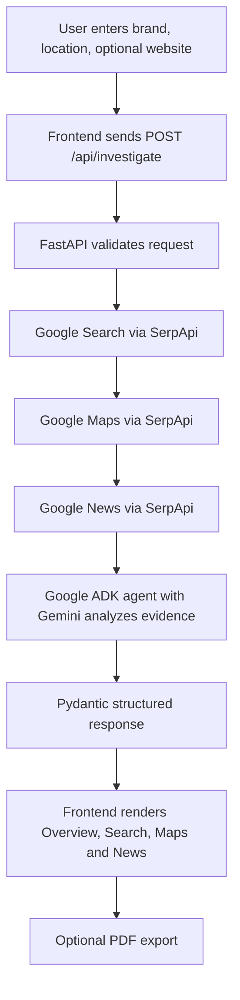

# BrandGuard360

**Evidence-based brand search-presence intelligence for businesses.**

BrandGuard360 helps a business review how its brand appears across Google Search, Google Maps, and Google News for a selected location. It brings returned search results, local listings, relevant news coverage, and potential competitors into one investigation report so that a business owner can decide what deserves a closer look.

> **Important:** BrandGuard360 is an evidence-review and decision-support tool. Search results are a snapshot of the data returned by connected services, not proof that every possible result, advertisement, or suspicious activity has been found. A competitor appearing in results is not automatically suspicious, and missing evidence is not proof that no risk exists.

## Live application

- **Frontend:** https://brandwatch360-serpapi.vercel.app/
- **Backend API:** https://brandguard360-backend.onrender.com/
- **Health check:** https://brandguard360-backend.onrender.com/health
- **Interactive API documentation:** https://brandguard360-backend.onrender.com/docs

The GitHub repository may retain its earlier repository name, `BrandWatch360-Serpapi-2026`; the product name shown to users is **BrandGuard360**.

---

## Contents

- [Problem](#problem)
- [Solution](#solution)
- [Design principles](#design-principles)
- [Main features](#main-features)
- [Investigation workflow](#investigation-workflow)
- [Architecture](#architecture)
- [Technology stack](#technology-stack)
- [Project structure](#project-structure)
- [How an investigation works](#how-an-investigation-works)
- [API reference](#api-reference)
- [Local development](#local-development)
- [Environment variables](#environment-variables)
- [Deployment](#deployment)
- [PDF report export](#pdf-report-export)
- [Evidence and classification rules](#evidence-and-classification-rules)
- [Troubleshooting](#troubleshooting)
- [Security notes](#security-notes)
- [Current scope and limitations](#current-scope-and-limitations)

## Problem

A business owner may search for their own company and still lack a complete picture of what potential customers see. Search results can vary by query and location. A business may also want to check whether its official website appears, whether local listings represent the right business, what relevant news is being published, and which other brands operate in the same market.

Checking those different sources manually takes time and makes it easy to confuse ordinary competition or unrelated search results with meaningful warning signs.

BrandGuard360 addresses this visibility and interpretation problem by collecting evidence from several public search surfaces and presenting it together with source links and cautious explanations.

## Solution

A user starts an investigation by supplying:

- **Brand/company name** — the business being investigated.
- **Location** — the geographic focus, such as a city or city and state.
- **Owner website (optional)** — the official website that should be checked against returned organic results.

The backend searches the brand using the existing SerpApi-powered Google Search, Google Maps, and Google News tools. A Google ADK agent using Gemini reviews the results and returns structured findings. The frontend presents the report in separate Overview, Search, Maps, and News views.

BrandGuard360 does not assign a numerical trust score. It focuses on the evidence returned, why the evidence may matter, and when the available information is insufficient to make a reliable determination.

## Design principles

1. **Brand and location are separate inputs.** The brand identifies what is investigated. The location identifies where to focus the investigation. Geographic context must not replace the brand as the subject.
2. **Evidence before conclusions.** Display real results and source links. Do not invent advertisements, articles, businesses, competitors, or URLs.
3. **No automatic accusations.** A different domain, a competitor, an unrelated organic result, or a missing Maps listing is not by itself proof of wrongdoing.
4. **Honest uncertainty.** Distinguish a successful search with no relevant result from a failed or unavailable source.
5. **Current investigation only.** Results, counts, explanations, and links must belong to the active investigation rather than a previous request.
6. **Keep source context.** Search, Maps, and News evidence should remain identifiable as separate sources while informing the combined assessment.

## Main features

### Overview

Summarizes the current investigation, its location, overall signal, and key findings from Search, Maps, and News. It provides an entry point to the source-specific findings and report export.

### Google Search

- Checks organic results for the investigated brand and location.
- Shows the owner-website status relative to the organic results returned for the investigation.
- Presents returned result titles, domains, positions when available, snippets/reasons, relevance information, and source links.
- Presents the **Potential Competitors** section using brands identified dynamically from investigation evidence, rather than a hardcoded list.

The current Search UI intentionally does not show a separate Advertisements section or a separate Mentioned Brands section. The backend response schema can still carry advertisement data when the search tool returns it.

**Owner website wording matters:** if a supplied website does not appear in the returned organic results, that means it was not found in that result set. It does not mean the website itself does not exist.

### Google Maps

- Shows business listings returned for the investigation's brand and location.
- Preserves listing-specific identifying information when supplied by the tool, such as name, address, place ID, and Google Maps URL.
- Provides an individual **View on Maps** destination for a listing when a valid destination can be resolved.
- Provides a separate **Open in Google Maps** action for the overall investigated brand/location.
- Displays a listing count based on the actual Maps listing records.

A local business is not automatically associated with the investigated brand just because it operates in the same city. A missing listing is not, by itself, evidence of impersonation.

### Google News

Displays relevant news results and their source links where provided by the connected search service. Geographic mentions or general regional content should not automatically be treated as news about the investigated brand. If no relevant coverage is returned, the report should communicate that limitation instead of creating articles or claims.

### Potential Competitors

Identifies candidate competitor brands dynamically from available Search, Maps, and News evidence. The section is intended to show the actual brand name, why the brand may compete or is contextually related, and what the available evidence supports about suspicious activity. A company being a competitor does not make it suspicious.

Potential suspicion classifications used by the application include:

- **Suspicious Activity Found** — specific evidence supports a relevant suspicious signal.
- **No Suspicious Evidence Found** — the collected evidence did not establish suspicious activity.
- **Insufficient Evidence** — the available information is not enough for a reliable conclusion.

### Reports and PDF export

The frontend includes a Reports area and an export action for the current investigation. The PDF uses the active investigation's data and can include the investigation identity, summary/findings, source information, and other supported fields. The intended output filename is `BrandGuard360_<company>_<location>.pdf`.

## Investigation workflow

The tool order is fixed. All three source tools run for each investigation, in this sequence:

1. **Google Search** — gathers organic search evidence and sponsored-ad data when the service returns it.
2. **Google Maps** — gathers business listings in the requested geographic context.
3. **Google News** — gathers news coverage relevant to the brand and related market context.
4. **Gemini analysis through Google ADK** — evaluates the combined results and produces structured findings.
5. **FastAPI response** — validates/transforms the data into the frontend's response shape.
6. **Frontend rendering** — presents the current investigation in Overview, Search, Maps, and News views.



The location is passed as geographic context; it must not become the brand being investigated. For city/state inputs, the city is the primary geographic focus and the state helps disambiguate the location. The Search and News query instructions prioritize the brand and city rather than turning the state into the main query subject.

## Architecture

### Frontend

A static HTML, CSS, and JavaScript application. It submits investigations to the FastAPI backend, stores the active result for page rendering, and uses a bundled jsPDF library for report export. The runtime API configuration is loaded before the main frontend script.

### Backend

FastAPI validates the request, calls the existing investigation agent, transforms the agent's output into structured Pydantic models, and returns JSON. The backend also exposes a health endpoint and configures CORS from an environment variable.

### Agent and source services

A single Google ADK agent uses the configured Gemini model and three existing SerpApi service wrappers. The tool order is Search, Maps, then News. The sources are analyzed together; the agent should not replace missing source data with fabricated results.

## Technology stack

| Area | Technology | Role |
|---|---|---|
| Frontend | HTML, CSS, JavaScript | Static responsive interface and live API calls |
| Frontend report export | jsPDF | Builds a PDF report from the current investigation |
| Backend | Python, FastAPI | HTTP API and request/response handling |
| API server | Uvicorn | Runs the FastAPI application |
| Request/response validation | Pydantic | Defines and validates structured records |
| Agent orchestration | Google ADK | Runs the investigation agent and tools |
| Language model | Gemini (`gemini-3.5-flash-lite` in the current agent configuration) | Analyzes collected source evidence |
| Search provider | SerpApi | Supplies Google Search, Google Maps, and Google News results through the existing tool package |
| Configuration | python-dotenv and environment variables | Loads local settings and deployment secrets |
| Frontend hosting | Vercel | Hosts the static frontend |
| Backend hosting | Render | Hosts the Python API |

The backend uses `serpapi-search-tools` for the existing ADK-compatible source tools. Current service wrappers request up to 10 results per source call. Actual returned results can be fewer, and not every query necessarily returns advertisements or relevant news.

## Project structure

The important application files are organized as follows:

```text
.
├── Backend/
│   ├── main.py                 # FastAPI app, health and investigation endpoints, CORS
│   ├── agent.py                # Google ADK agent and investigation instructions
│   ├── schemas.py              # Pydantic request, response, and evidence models
│   ├── location_utils.py       # Location normalization helpers
│   ├── domain_utils.py         # Domain normalization and matching helpers
│   ├── requirements.txt        # Python production dependencies
│   └── Services/
│       ├── __init__.py
│       ├── web_service.py      # Google Search tool wrapper
│       ├── maps_service.py     # Google Maps tool wrapper
│       └── news_service.py     # Google News tool wrapper
├── Frontend/
│   ├── index.html              # Main static application page
│   ├── css/
│   │   └── styles.css          # Application styling
│   └── js/
│       ├── config.js           # Runtime local/production API URL selection
│       ├── main.js             # UI state, API request, source views, PDF export
│       └── jspdf.umd.min.js    # PDF export library
├── .gitignore                  # Excludes local secrets and generated files
└── README.md
```

Some repository or development copies may contain additional helper or legacy files. The tree above lists the core files relevant to the running application.

## How an investigation works

### 1. Input validation

The API requires a company name and location. The owner website is optional. Blank company names and blank locations are rejected with HTTP 400 responses.

### 2. Location and domain handling

The backend normalizes location information for search context and uses domain helpers to compare the supplied owner website with the domains/URLs in returned organic results. Domain matching should compare domains safely rather than by arbitrary substring matching.

### 3. Search evidence

The Google Search wrapper uses the Google engine, requests up to 10 results, and requests full structured output. The agent extracts organic result information and any sponsored advertisements actually returned by the tool.

### 4. Maps evidence

The Maps wrapper requests up to 10 results. Each returned listing may include a name, address, place ID, and listing-specific Google Maps URL. A listing-specific link should be used for an individual listing; the overall investigation link is a separate action.

### 5. News evidence

The News wrapper requests up to 10 results. The model must distinguish articles that meaningfully relate to the brand from generic city/state pages or unrelated market content.

### 6. Combined findings

The agent considers website visibility, sponsored ads when available, potential lookalike/local listing signals, relevant news, and candidate competitors. It must distinguish direct observations from interpretation and preserve uncertainty where evidence is incomplete.

### 7. Structured result

The backend converts the agent result into the API's `InvestigationResponse`, then the frontend renders the current result. A failed request must not be replaced with mock or stale results.

## API reference

### `GET /health`

Used to check whether the deployed service is responding.

**Example response:**

```json
{
  "status": "ok"
}
```

### `POST /api/investigate`

Starts an investigation.

**Request body:**

```json
{
  "company_name": "<brand name>",
  "location": "<city or city, state>",
  "website": "<optional official website URL>"
}
```

`company_name` and `location` are required. `website` may be an empty string when no owner website is supplied.

**Response fields** include:

| Field | Description |
|---|---|
| `brand`, `company_name` | Investigated brand identity |
| `location`, `investigation_location` | Submitted and normalized investigation location |
| `website` | Optional owner website supplied with the request |
| `search_queries` | Queries recorded for the investigation |
| `owner_website_status` | Presence of the owner domain in returned organic results, or not provided |
| `organic_findings` | Search findings summary |
| `organic_results` | Structured organic results with title, URL, domain, position, type, relevance, snippet, and reason fields where available |
| `advertisement_findings`, `advertisements` | Advertisement summary and structured ad records when returned by the source tool; the current UI does not render a separate Ads section |
| `potential_competitors` | Candidate competitor names, contextual relevance, suspicion status, and reasoning |
| `maps_findings`, `maps_results` | Maps summary and structured listing data, including Maps destinations where available |
| `news_findings` | News findings summary |
| `anomaly_detected`, `overall_signal` | Combined anomaly flag and overall status |
| `executive_summary`, `explanation` | Summary and explanation of the investigation |
| `source_links` | Source URLs associated with returned evidence |
| `web_search_report` | Readable Search report retained by the backend |

The precise fields on each individual record depend on the structured response and information supplied by the source tool. Missing source fields should not be replaced with fabricated values.

### API documentation

When the backend is running, FastAPI serves interactive API documentation at `/docs` and an OpenAPI schema at `/openapi.json`.

## Local development

### Prerequisites

- Python compatible with the pinned packages in `Backend/requirements.txt`.
- A Google API key permitted to use the configured Gemini model.
- A SerpApi API key with access to the configured search engines.
- Git, if cloning the repository.

### 1. Clone the repository

```bash
git clone <your-github-repository-url>
cd <repository-folder>
```

Replace the placeholders with your repository URL and folder name.

### 2. Create and activate a virtual environment

**Windows PowerShell:**

```powershell
python -m venv .venv
.\.venv\Scripts\Activate.ps1
```

**macOS/Linux:**

```bash
python3 -m venv .venv
source .venv/bin/activate
```

### 3. Install backend dependencies

From the repository root:

```bash
pip install -r Backend/requirements.txt
```

### 4. Configure local environment variables

Create a local `.env` file in the repository root when running the backend from the repository root. Add your own key values:

```dotenv
GOOGLE_API_KEY=your_google_api_key
SERPAPI_API_KEY=your_serpapi_api_key
ALLOWED_ORIGINS=http://localhost:5500,http://127.0.0.1:5500,http://localhost:3000,http://127.0.0.1:3000
```

Do not commit this file. The names above must match the variable names used by the running code. If you launch the process with a different working directory, ensure `python-dotenv` can find the `.env` file or set the environment variables directly in your shell.

### 5. Start the backend

From the repository root:

```bash
uvicorn Backend.main:app --host 0.0.0.0 --port 8000 --reload
```

Check the health route at `http://localhost:8000/health`. The API documentation should be available at `http://localhost:8000/docs`.

### 6. Start the static frontend

Use a local static server rather than opening `index.html` directly, so browser origins and requests behave consistently.

From the `Frontend` directory, run:

```bash
python -m http.server 5500
```

Open `http://localhost:5500`. The frontend runtime configuration chooses `http://localhost:8000` for local development and the Render API URL for deployed hosts.

If local API requests are blocked, confirm the frontend's local origin is included in `ALLOWED_ORIGINS` and restart the backend after changing environment variables.

## Environment variables

| Variable | Required | Purpose |
|---|---|---|
| `GOOGLE_API_KEY` | Yes for the configured Gemini integration | Authenticates requests to Google's GenAI services, as configured in the project |
| `SERPAPI_API_KEY` | Yes | Authenticates SerpApi source-search requests |
| `ALLOWED_ORIGINS` | Recommended in deployment | Comma-separated list of allowed browser origins for FastAPI CORS |
| `PORT` | Supplied by Render in deployment | Port used by the running web service; Uvicorn uses `$PORT` in Render's start command |

Never place provider keys in browser JavaScript, public source files, screenshots, logs, or Git commits. Frontend configuration contains only the public backend URL, not provider credentials.

## Deployment

The production application is split between Vercel (frontend) and Render (backend).

### Backend on Render

Current service URL: https://brandguard360-backend.onrender.com/

Recommended settings for this repository:

- **Service type:** Web Service
- **Runtime:** Python 3
- **Root directory:** `Backend`
- **Build command:** `pip install -r requirements.txt`
- **Start command:** `uvicorn main:app --host 0.0.0.0 --port $PORT`

Configure these environment variables in the Render service dashboard:

- `GOOGLE_API_KEY`
- `SERPAPI_API_KEY`
- `ALLOWED_ORIGINS=https://brandwatch360-serpapi.vercel.app`

Keep `ALLOWED_ORIGINS` as a comma-separated list if additional Vercel preview or custom domains must be allowed. Use exact origins, including `https://`, and normally omit a trailing slash. After changing environment variables, wait for Render to finish redeploying.

Verify the deployment by opening:

- `https://brandguard360-backend.onrender.com/health`
- `https://brandguard360-backend.onrender.com/docs`

### Frontend on Vercel

Current application URL: https://brandwatch360-serpapi.vercel.app/

The frontend is a static HTML/CSS/JavaScript application:

- **Repository:** existing BrandGuard360 GitHub repository (it may retain its previous repository name)
- **Root directory:** `Frontend`
- **Framework preset:** `Other`
- **Build command:** none required for plain static files
- **Output directory:** leave blank if accepted by Vercel; otherwise use the static root directory (`.`) according to the Vercel project settings

The runtime script `Frontend/js/config.js` must load before `Frontend/js/main.js`. In local development it points the frontend to `http://localhost:8000`; in production it points to `https://brandguard360-backend.onrender.com`.

### CORS connection

The frontend origin must be included in the backend's `ALLOWED_ORIGINS` list. If the browser reports a CORS error after deployment, check the exact origin of the page in the browser address bar and add that origin to Render's allowed list. Then wait for the backend to redeploy.

## PDF report export

The frontend bundles jsPDF and exports the active investigation as a PDF. The report should use the current investigation state—brand, location, owner website, findings, and available source data—without issuing a second investigation or substituting old/mock data. The expected filename convention is:

`BrandGuard360_<company>_<location>.pdf`

The generated report is a summary of collected information and should be interpreted under the same evidence limitations as the web report.

## Evidence and classification rules

BrandGuard360 is designed to be cautious and transparent:

- The owner website does not have to rank first to be legitimate.
- A website not found in the returned result set is not the same as a website that does not exist.
- A different sponsored advertiser is not automatically impersonating the investigated brand.
- A competitor advertising legitimate services is not automatically suspicious.
- A directory, marketplace, or social result is not automatically an anomaly.
- A local Maps listing is not associated with the investigated brand unless the available evidence supports the connection.
- A missing Maps listing is not proof of impersonation.
- General news about a city or state is not automatically brand-related news.
- A competitor being present in the market is not evidence of wrongdoing.
- **No Suspicious Evidence Found** means the collected evidence did not establish suspicious activity; it is not a guarantee of safety.
- A source returning no relevant records is different from that source failing or being unavailable.

The investigation should preserve original source links and distinguish observed source information from model interpretation. Do not make legal claims or accusations based only on the generated report.

## Troubleshooting

### The frontend displays “Investigation Could Not Be Completed”

1. Open the Render dashboard for the backend service.
2. Inspect the deployment and runtime logs at the time of the failed request.
3. Find the original exception and traceback; the browser's generic HTTP 500 message is not enough to determine the root cause.
4. Confirm the environment variables exist in Render without exposing their values.
5. Check whether the failure occurred during a SerpApi call, Gemini/ADK execution, structured output parsing, or response validation.
6. Fix the underlying error; do not hide it by returning mock data.

### The browser reports a CORS error

- Confirm that `ALLOWED_ORIGINS` contains the exact deployed frontend origin.
- Check for spelling mistakes, an incorrect protocol, or an unintended trailing slash.
- If multiple origins are allowed, separate them with commas.
- Save changes and wait for Render to redeploy.

### The health endpoint works but investigations fail

The health route confirms that the API process responds. It does not prove that Gemini credentials, SerpApi credentials, source tool calls, or agent output validation are all working. Review the backend logs and perform a live request through `/api/investigate`.

### Local requests work but production requests fail

- Confirm `Frontend/js/config.js` loads before `Frontend/js/main.js`.
- Confirm production uses `https://brandguard360-backend.onrender.com` rather than `localhost`.
- Confirm the Render CORS allowlist includes the deployed Vercel domain.
- Check browser Network tools and Render logs to distinguish CORS failures from API responses such as HTTP 400, 429, or 500.

### Results look unrelated to the brand

- Confirm the submitted brand and location in the request.
- Check the actual Search, Maps, and News query arguments and returned source records.
- Ensure the brand remains the investigation subject and location remains geographic context.
- Check relevance filtering and source metadata mapping before changing the visual design.
- Do not treat unrelated sources as brand evidence or replace empty results with invented records.

## Security notes

- Keep `.env` out of version control; verify `.gitignore` before pushing commits.
- Do not expose Google or SerpApi keys in frontend code, public screenshots, issue trackers, or logs.
- If a key is accidentally committed or shared, rotate it with the provider and update deployment secrets.
- The browser may safely know the backend's public URL, but it must never call Gemini or SerpApi directly with secret credentials.
- The production API should be used with appropriate access controls and usage monitoring if the project is opened to a wider audience.

## Current scope and limitations

- Results depend on the queries and source records returned by SerpApi at the time of an investigation.
- Local search results can vary by location, query wording, and search provider behavior.
- Advertisements may not be returned for a particular query. The current UI intentionally omits the separate Advertisements and Mentioned Brands sections, although the API schema still supports advertisement records.
- The agent summarizes available evidence; it cannot prove the absence of all brand misuse or guarantee that every relevant page has been returned.
- Competitor relevance and suspicious status depend on source evidence and must remain uncertain when that evidence is insufficient.
- The current project uses an in-memory ADK session service. It is not a persistent investigation database; do not assume that investigation history is permanently stored across backend restarts unless a separate persistence feature has been implemented.
- Provider quota, network errors, model availability, and hosting cold starts can affect response time or availability.

## Project status

BrandGuard360 is deployed with a static frontend on Vercel and a FastAPI backend on Render. The current core workflow investigates a brand across Google Search, Google Maps, and Google News, analyzes the combined evidence with a Google ADK agent powered by Gemini, and renders a structured, evidence-based report.

For bug reports, include the endpoint, approximate time, request inputs without secrets, and the relevant backend traceback. Never attach `.env` files or API key values.
